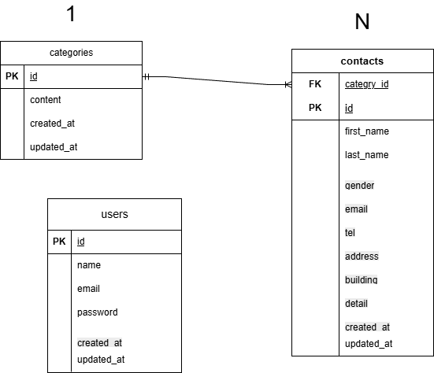

# アプリケーション名

coachtech お問い合わせフォーム

## アプリケーション概要

お問い合わせ内容を登録・管理できるアプリケーションです。

## 環境構築

### Dockerビルド

```bash
git clone https://github.com/HO826/honda-kadai1.git
cd honda-kadai1
docker-compose up -d --build
```

### Laravel環境構築

```bash
docker-compose exec php bash
composer install
```

### .env設定

```bash
cp .env.example .env
```

※DB接続がうまくいかない場合は.envを以下のように設定してください

```env
DB_HOST=mysql
DB_PORT=3306
DB_DATABASE=laravel_db
DB_USERNAME=laravel_user
DB_PASSWORD=laravel_pass
```

```bash
php artisan key:generate
php artisan migrate
php artisan db:seed
```

## 使用技術（実行環境）

- PHP 8.5.1
- Laravel 8.83.8
- MySQL 8.0.45
- nginx 1.21.1

## URL

- お問い合わせ画面：http://localhost:8082
- ユーザー登録：http://localhost:8082/register
- phpMyAdmin: http://localhost:8081

※上記URLはDocker環境起動後にアクセス可能です。

---

## 機能一覧

- お問い合わせフォーム入力 / 送信
- バリデーション機能
- 管理画面での一覧表示
- 検索機能
- ユーザー登録 / ログイン、ログアウト機能

## ER図



### ■ テーブル構造

#### categories

お問い合わせの種類を管理するテーブルです。

- id (PK)
- content
- created_at
- updated_at

#### contacts

お問い合わせ内容を管理するテーブルです。

- id (PK)
- category_id (FK)
- first_name
- last_name
- gender
- email
- tel
- address
- building
- detail
- created_at
- updated_at

#### users

管理者ユーザーを管理するテーブルです。

- id (PK)
- name
- email
- password
- created_at
- updated_at

---

### ■ リレーション

- categories：1 → N：contacts

---
